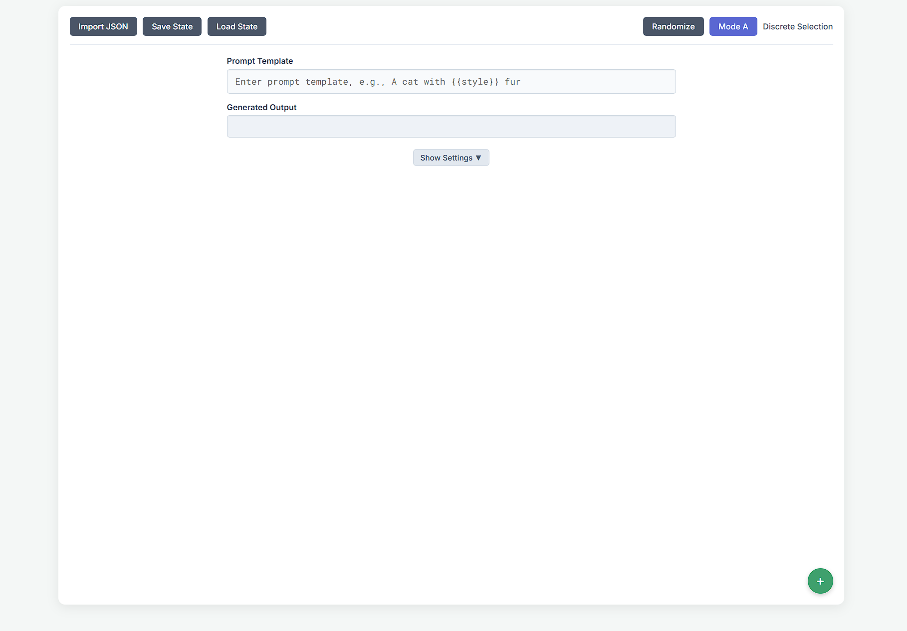

## P5.js Integration Guide

### Using MIDI Controllers with P5.js Sketches

Synthograsizer now supports direct MIDI control of your p5.js sketches in Mode D. This allows for real-time interaction with your generative art through physical controllers. Here's how to use this feature:

1. **Setup Variables in Mode C**:
   - Create variables with appropriate template names (e.g., `color`, `size`, `speed`).
   - Add several values to each variable to allow for variation.

2. **Map MIDI Controls in Mode A or B**:
   - Connect your MIDI controller to your computer.
   - Switch to Mode A or B where knobs are visible.
   - Move MIDI controls to automatically map them to knobs.
   - Test different controls to see which ones work best with your variables.

3. **Switch to Mode D**:
   - The MIDI mappings will persist when switching to Mode D.
   - The MIDI Status Panel will display which MIDI controls are mapped to which variables.

4. **Write P5.js Code with MIDI Awareness**:
   ```javascript
   let currentColor = 'white';  // Default value
   let currentSize = 50;        // Default value
   
   p.setup = function() {
     p.createCanvas(400, 200).parent(p5Output);
     
     // Register for MIDI variable changes
     p.onVariableChange((name, value) => {
       console.log(`MIDI update: ${name} = ${value}`);
       
       // Store the values in global variables
       if (name === 'color') currentColor = value;
       if (name === 'size') currentSize = parseFloat(value) || 50;
     });
   };
   
   p.draw = function() {
     // Use the MIDI-updated variables in your draw loop
     p.background(0);
     p.fill(currentColor);
     p.ellipse(p.width/2, p.height/2, currentSize, currentSize);
   };
   ```

5. **Run Your Sketch**:
   - Click the "Run Code" button to start your sketch.
   - Manipulate your MIDI controls to see real-time changes in your sketch.
   - Check the p5.js console for debug information about MIDI events.

### Troubleshooting MIDI Integration

- **No MIDI Updates**: Check the console for debug messages. Make sure you have registered a listener with `p.onVariableChange()`.
- **Wrong Variables**: Verify that your template names match exactly in your `onVariableChange` handler.
- **No MIDI Mappings**: If the MIDI Status Panel shows "No mappings yet", switch to Mode A and move some controls to establish mappings, then return to Mode D.
- **Incorrect Values**: For numeric variables, use `parseFloat()` or `parseInt()` to convert string values to numbers.# Synthograsizer (v2.6.1 - Client-Side JS + p5.js)

**Synthograsizer** is an interactive web-based creativity tool designed for manipulating text templates (like prompts for AI image generation or other text processing tasks) using a synthesizer-like interface with virtual knobs. It allows for dynamic generation and modification of text based on user-defined variables and real-time input, including integration with generative art via p5.js.

This version runs entirely in your web browser (client-side) with no backend server required.

[](placeholder.png)
*(Replace placeholder.png with an actual screenshot of the UI)*

## Latest Updates (v2.6.1)

*   **UI/UX Improvements:** Modernized header and footer layout, improved alignment, and updated About/Contact sections for a more polished user experience. The interface now uses a responsive flexbox structure for better layout on all devices.

*   **Enhanced MIDI Reliability:** 
    *   Improved MIDI device detection and connection handling
    *   Added "Refresh MIDI" button in Mode D for manually reconnecting devices
    *   Better error handling and recovery for MIDI connections
    *   More detailed MIDI diagnostic information in the console
*   **Improved p5.js Integration:**
    *   Enhanced variable change notification system for more reliable MIDI-to-p5.js communication
    *   Better error recovery when stopping sketches
    *   Added proper cleanup of resources when switching modes
    *   More informative console output for debugging
*   **General Stability Improvements:**
    *   Fixed potential issues with sketch initialization and cleanup
    *   Better error handling throughout the application
    *   Improved state management when switching between modes
*   **Optimized MIDI Performance (Mode D):** Implemented throttling for MIDI Control Change (CC) messages to reduce lag and improve responsiveness when adjusting parameters rapidly, especially while a p5.js sketch is running.

## Previous Updates (v2.4.0)

*   **Enhanced MIDI to p5.js Integration:** 
    *   Added real-time MIDI control of p5.js sketches in Mode D
    *   Implemented visual MIDI mapping panel to show active controls and values
    *   Added event notification system for responsive sketch interaction
    *   Improved console output with detailed MIDI event logging
*   **New Advanced p5.js Examples:**
    *   Added Recursive Fractal Tree generator with customizable parameters
    *   Added Conway's Game of Life cellular automaton simulator
*   **Enhanced p5.js Console:**
    *   Added dedicated console display for p5.js output and errors
    *   Improved error handling and visual feedback
    *   Added clear console button
    *   Separated console output from sketch display

## Previous Updates (v2.3.0)

*   **Improved p5.js Example Integration:** 
    *   Added a "Create Variables" button that automatically creates all the variables needed for any selected example
    *   Enhanced p5.js example loading with multiple path resolution and fallback to hardcoded examples
    *   Added detailed tooltips showing which variables each example needs
*   **Fixed Mode C Rendering:** Variable editor now properly displays in Mode C with improved reliability
*   **Improved WebMIDI Handling:** Addressed issues with repeated permission prompts when using MIDI devices

## Previous Updates (v2.2.0)

*   **Visual Knob Activity Indicators:** Knobs now provide visual feedback when their values change, with a subtle glow and scale effect.
*   **MIDI Mapping Indicators:** Visual indicators show which MIDI CC numbers are mapped to which knobs.
*   **Auto-Save Function:** The application now auto-saves your work to localStorage every 60 seconds, preventing work loss from accidental page refreshes.
*   **p5.js Example Library:** A dropdown menu lets you quickly load pre-built example sketches that demonstrate different ways to use Synthograsizer variables in p5.js.

## Project Templates

- Synthograsizer now supports reusable project templates for common creative tasks.
- Includes built-in templates such as the Character Generator, accessible via the Project Template button in the UI.
- Enhanced template system allows for quick setup and consistent formatting across projects.

## Prompt Metadata Manager

- Extracts and displays metadata from PNG images, including prompt and parameter information.
- Supports prompt/parameter splitting for easy organization.
- Includes a convenient copy-to-clipboard button for exporting metadata.
- Access via `PromptMetadataManager.html` in the project files.

## Core Concept

The central idea is to combine the tactile, immediate feedback of synthesizer controls with the flexibility of text generation. You define:

1.  **Text Templates:** Base text containing placeholders marked with double curly braces (e.g., `A futuristic cityscape in the style of {{artist_style}}, {{time_of_day}} light`).
2.  **Variables:** Named entities (like `artist_style` or `time_of_day`) that correspond to the placeholders.
3.  **Values:** A list of possible text options for each variable (e.g., for `artist_style`: "Moebius", "Syd Mead", "Greg Rutkowski"; for `time_of_day`: "golden hour", "midday", "neon twilight").

The interactive knobs allow you to select or blend between these values, instantly updating the generated output text in real-time. Mode D extends this by allowing p5.js sketches to react to these knob values.

## Key Features

- **Fun Stuff Embed:** Explore interactive and experimental features in the “Fun Stuff” section, accessible from the main navigation.

*   **Interactive Knobs:** Control variable values using clickable and draggable knobs (up to 32). Supports locking individual knobs to prevent accidental changes.
*   **Multiple Modes:**
    *   **Mode A (Discrete Selection):** Each knob selects a specific text value from its variable's list (e.g., clicking or dragging steps through "Moebius", "Syd Mead", etc.). Output uses the selected text directly.
    *   **Mode B (Continuous Adjustment):** Knobs provide a continuous float value (-1.0 to +2.0). This value influences the output using `(value:weight)` syntax (compatible with some AI generation tools like Stable Diffusion). The underlying text value is chosen based on the knob's position relative to the discrete options, and the weight is calculated based on the continuous value (values > 0 increase weight, < 0 decrease weight).
    *   **Mode C (Variable Editor):** A dedicated interface to add, remove, and edit variable definitions:
        *   **Display Name:** The label shown below the knob in the UI.
        *   **Template Name:** The identifier used within `{{...}}` placeholders in your text templates. (Should be unique and contain only letters, numbers, underscores).
        *   **Values:** The list of possible text strings for the variable. Add, edit, and delete values easily.
    *   **Mode D (p5.js Integration):**
        *   Run custom p5.js sketches directly within the tool's interface.
        *   Sketches can access the current state of Synthograsizer variables in **real-time** using the `p.getSynthVar('template_name')` function within their `draw()` loop.
        *   `getSynthVar` returns the selected **string value** in Mode A, the **float value** (-1 to 2) in Mode B, and `undefined` in Modes C/D.
        *   Sketches can also query the current Synthograsizer mode using `p.getSynthMode()`.
        *   Includes "Run Code" and "Stop Sketch" buttons.
        *   Robust error handling: Initialization errors are displayed in the output area; runtime errors within the sketch are displayed on the p5 canvas itself.
*   **Variable Management:**
    *   Add new variables quickly using the '+' button (up to `MAX_VARIABLES`).
    *   Edit variable names, template names, and values intuitively in Mode C.
    *   Import variable definitions and basic settings from a simple JSON file format.
*   **State Management:**
    *   **Save State:** Download a complete snapshot of the application state (variables, knob positions/data, mode, all UI text fields, settings visibility, p5 code) to a JSON file.
    *   **Load State:** Load a previously saved state file to restore your entire session exactly as it was.
*   **MIDI Control:**
    *   Connect MIDI controllers to manipulate knobs physically.
    *   Automatically maps incoming MIDI Control Change (CC) messages to the next available, unlocked knob in Mode A or Mode B.
    *   MIDI mappings persist when switching to Mode D, allowing real-time control of p5.js sketches.
    *   Visual feedback in the MIDI Status Panel shows which controls are mapped to which variables.
    *   Provides console debugging information for troubleshooting MIDI connections.
*   **Collapsible Settings Area:**
    *   Includes fields for common AI generation parameters: Negative Prompt, Height, Width, CFG Scale, Sampling Steps, Denoising Strength, Img2img Source.
    *   These fields are simple text inputs saved/loaded with the state but do not directly affect knob behavior (they are part of the overall context you might use the generated prompts in).
*   **Client-Side Operation:** Runs entirely in the web browser using HTML, CSS, and JavaScript. No Python backend, server setup, or internet connection (after initial load) needed.
*   **Tooltips:** Provides helpful hints on UI elements on hover for easier discovery.

## How to Run

1.  **Download:** Get the project files: `index.html`, `script.js`, `style.css`, and the `p5-examples` directory.
2.  **Same Folder:** Place all files in the **same directory structure** on your computer (maintain the `p5-examples` subfolder).
3.  **Open:** Double-click the `index.html` file. It should open in your default web browser.
    *   **Recommended Browsers:** Chrome, Firefox, Edge (recent versions supporting WebMIDI and modern JavaScript).

## File Structure

*   `index.html`: Defines the HTML structure, layout, and elements of the web page. Includes the p5.js library script tag.
*   `style.css`: Contains all the CSS rules for styling the appearance, layout, colors, fonts, and responsiveness of the interface.
*   `script.js`: Holds all the JavaScript logic, including:
    *   State management (variables, mode, settings).
    *   DOM manipulation and event handling (button clicks, knob drags).
    *   Mode switching logic.
    *   Knob value calculation and visual updates.
    *   Text output generation based on templates and knob states.
    *   Variable editor functionality (Mode C).
    *   p5.js sketch execution, control (`getSynthVar`), and error handling (Mode D).
    *   Save/Load/Import functionality.
    *   MIDI initialization and message handling.
    *   Tooltip management.
*   `p5-examples/`: Directory containing example p5.js sketches:
    *   `basic_shapes.js`: Simple example controlling shapes with Synthograsizer variables.
    *   `particle_system.js`: Advanced example with a particle simulation controlled by variables.
    *   `audio_visualizer.js`: Complex example simulating an audio visualizer controlled by variables.

## Usage Guide

### General Interface

*   **Top Bar:** Contains buttons for Import/Save/Load, Randomize, and Mode switching.
*   **Main Prompt Area:** Enter your primary text template in "Prompt Template". The real-time generated text appears in "Generated Output".
*   **Settings Area:** Click "Show Settings ▼" to reveal fields for Negative Prompt, Dimensions, etc. These are saved with the state.
*   **Dynamic Content Area:** This section changes based on the selected Mode (showing Knobs, the Variable Editor, or the p5.js Editor).
*   **Add Variable Button (`+`):** Located at the bottom right; click to add a new variable/knob.

### Mode A: Discrete Selection

*   **Purpose:** Select specific text options for each variable.
*   **Interaction:**
    *   **Click:** Cycles to the next value in the variable's list.
    *   **Drag Vertical:** Dragging up increases the selected index, down decreases it.
*   **Output:** The generated text uses the exact string selected for each `{{placeholder}}`.
*   **Knob Display:** Shows the *index* (0, 1, 2...) of the selected value.

### Mode B: Continuous Adjustment

*   **Purpose:** Adjust variables smoothly and apply weighting to the output.
*   **Interaction:**
    *   **Drag Vertical:** Changes the continuous float value between -1.00 and +2.00. Clicking is disabled.
*   **Output:** The generated text uses `(value:weight)` syntax for placeholders where the weight is significantly different from 1.0.
    *   The `value` part is the discrete text option closest to the knob's position.
    *   The `weight` is calculated based on the -1 to 2 float value (e.g., > 0 increases emphasis, < 0 decreases emphasis).
*   **Knob Display:** Shows the *float value* (e.g., `1.35`, `-0.50`).

### Mode C: Variable Editor

*   **Purpose:** Define and manage your variables and their possible values.
*   **Interface:** Displays a list of all defined variables.
    *   **Variable Info:** Edit the "Display Name" (UI label) and "Template Name" (used in `{{...}}`). Template names are automatically sanitized (letters, numbers, underscores only).
    *   **Values:** View the list of text values for the variable.
        *   Click the 'X' button to delete a value (confirmation required).
        *   Type a new value in the "Type new value..." box and press Enter to add it.
        *   Click into an existing value's text box to edit it; changes are saved on blur or Enter.

### Mode D: p5.js Integration with MIDI Control

*   **Purpose:** Run generative art sketches that react to the Synthograsizer's state and MIDI controllers.
*   **Interface:**
    *   **Code Editor:** A textarea to write or paste your p5.js code. It includes a helpful placeholder example.
    *   **Run Code Button:** Executes the code in the editor. Stops any previous sketch first.
    *   **Stop Sketch Button:** Manually stops the currently running sketch.
    *   **Examples Dropdown:** Quickly load pre-built example sketches from the p5-examples directory.
    *   **Create Variables Button:** Automatically creates all the variables needed for the selected example sketch.
    *   **MIDI Status Panel:** Displays which MIDI controls are mapped to which variables and their current values.
    *   **p5.js Console:** Shows debug output and error messages from your sketch.
    *   **Output Area:** Where the p5.js canvas is created, or where error messages are displayed.
*   **MIDI Control in p5.js:**
    *   Variables can be controlled in real-time using MIDI controllers even in Mode D.
    *   Register for MIDI updates in your sketch using `p.onVariableChange((name, value) => { /* handle change */ });`
    *   Place the `onVariableChange` call in your `setup()` function, not in `draw()`.
    *   Use global variables to store MIDI-updated values for use in the `draw()` function.
*   **Sketching Workflow:**
    1.  Write your p5.js code. Define `p.setup()` and `p.draw()` functions as usual within the p5 instance scope (the `p` object passed to the sketch).
    2.  **Crucially:** Inside your `p.setup()` function, register for MIDI updates with `p.onVariableChange()`.
    3.  Inside your `p.draw()` function (or any function needing live data), call `p.getSynthVar('your_template_name')` to get the current value associated with that variable's knob. Replace `'your_template_name'` with the exact "Template Name" you defined in Mode C.
    4.  **Understand `getSynthVar` Return Value:**
        *   If Synthograsizer is in **Mode A**: Returns the currently selected **string** value (e.g., `"photorealistic"`).
        *   If Synthograsizer is in **Mode B**: Returns the current **float** value (e.g., `1.75`, `-0.20`).
        *   If Synthograsizer is in **Mode C or D**: Returns `undefined`. Your sketch should handle this case (e.g., use a default value).
    5.  You can also get the current Synthograsizer mode using `p.getSynthMode()`, which returns 'A', 'B', 'C', or 'D'.
    6.  Use the retrieved values to control aspects of your sketch (colors, sizes, speeds, behaviors, etc.).
    7.  Click "Run Code".
*   **Additional Helper Functions:**
    *   `p.getVariableDefinition(featureName)`: Get the complete variable definition including all possible values.
    *   `p.getAllVariables()`: Get all variable values in a single object.
    *   `p.print()`: Output debugging information to the p5.js console.
*   **Error Handling:**
    *   Errors during p5 initialization (e.g., syntax errors outside `setup`/`draw`) will show as text in the output area below the editor.
    *   Errors occurring *during* sketch execution (e.g., inside `draw`) will be displayed *on the p5 canvas itself* with a red background. Check the browser's developer console for more detailed stack traces in both cases.

### Other Features

*   **Knob Locking:** Double-click any knob in Mode A or B to lock/unlock it. Locked knobs ignore clicks, drags, randomization, and MIDI input.
*   **Randomize:** In Mode A or B, click "Randomize" to set all *unlocked* knobs to new random values (discrete index for A, float value for B).
*   **Save/Load State:** Use "Save State" to save everything (prompts, variables, values, knob states including locked status and underlying data, mode, settings, p5 code) to a JSON file. Use "Load State" to restore a previous session from such a file. This stops any running p5 sketch.
*   **Import JSON:** Use "Import JSON" to load variables and basic settings from a simpler JSON structure (primarily focused on the `variables` array and `stable_diffusion_input`). This is useful for sharing variable definitions without the full UI state. Resets current knob positions/UI state.
*   **MIDI Control:** If a MIDI controller sending CC messages is connected, unlocked knobs in Mode A/B will automatically respond. Mapping prioritizes lower-indexed knobs first. Check the console for mapping info. Disconnecting/reconnecting devices should update the available inputs.

## Technical Details

- **Static Hosting:** All application files are now served from the repository root for improved static hosting compatibility.
- **Codebase Cleanup:** Removed non-original code (fidenza.js) for clarity and licensing compliance.

*   **Libraries:** Uses the p5.js library (loaded via CDN) for Mode D graphics rendering and sketch execution.
*   **State:** The application state is managed in JavaScript variables and directly reflected in the DOM. Saving state serializes the core `variables` array, input field values, and knob data attributes (`value`, `data-locked`, `data-variable-value-a`, `data-variable-value-b`) into a JSON structure.
*   **Interaction:** Primarily driven by DOM event listeners (mousedown, mousemove, mouseup, click, input, change, keydown) attached to buttons, knobs, and input fields.
*   **p5 Communication:** The p5 sketch communicates with the main application *pulling* data via the injected `p.getSynthVar()` and `p.getSynthMode()` functions within its own `draw` loop. The main application does not push updates into the sketch.

## Future Plans / Roadmap

This is a work in progress. Potential future enhancements include:

### UI/UX Improvements

*   ~~**Visual MIDI Feedback:** Indicate which knob is mapped to which MIDI CC directly on the UI.~~ ✓ Implemented in v2.2.0
*   ~~**Knob Activity Indicator:** Subtle visual feedback when a knob's value changes (e.g., brief glow).~~ ✓ Implemented in v2.2.0
*   ~~**Improved MIDI Permissions:** Fix issues with repeated WebMIDI permission prompts.~~ ✓ Implemented in v2.3.0
*   **Themes:** Allow users to select different color themes.
*   **Layout Options:** Potentially allow more knobs or different arrangements.
*   **Improved Mode C Editor:** Better drag-and-drop reordering of values or variables.

### Core Functionality

*   **New Modes:**
    *   **Interpolation Mode:** Smoothly interpolate between multiple text values based on knob position.
    *   **Advanced Weighting:** Define custom curves or scales for Mode B weighting.
*   **Presets:** Save/Load just the variable definitions and knob values as named presets, separate from the full application state.
*   ~~**Auto-Save:** Automatically save the application state to prevent work loss from accidental page refreshes.~~ ✓ Implemented in v2.2.0
*   **Direct API Integration:** Option to configure and directly send generated prompts/parameters to local or remote AI APIs (e.g., Stable Diffusion WebUI API, ComfyUI API, Replicate).
*   **OSC Support:** Add Open Sound Control (OSC) input/output for integration with other creative coding tools (Processing, TouchDesigner, Max/MSP).
*   **Advanced MIDI Mapping:** Allow manual mapping of specific CCs/channels to knobs, saving MIDI maps. Support for different MIDI message types (Note On/Off?).

### p5.js Enhancements

*   **Error Console:** Embed a small console-like area within the UI to show p5.js `print()`/`console.log()` output and clearer errors.
*   **Helper Functions:** Inject more helper functions into the p5 sketch (e.g., `p.getVariableDefinition('name')` to get all values).
*   ~~**Example Library:** Include a small library of example p5 sketches demonstrating different ways to use `getSynthVar`.~~ ✓ Implemented in v2.2.0
*   ~~**Variable Integration:** Auto-create variables needed by example sketches.~~ ✓ Implemented in v2.3.0

### Code & Architecture

*   **Refactoring:** Improve code organization, potentially breaking `script.js` into modules.
*   **Documentation:** Add more inline code comments.
*   **Testing:** Implement basic unit or integration tests.
*   **Build Process:** Introduce a build step if complexity increases (e.g., for bundling modules, transpiling).

## Contributing

Contributions, suggestions, and bug reports are welcome! Please feel free to open an issue or submit a pull request on the project repository (if applicable).

## License

*(Choose and specify a license)*

Example: `This project is licensed under the MIT License - see the LICENSE.md file for details.` (You would need to create a LICENSE.md file with the MIT license text). Or specify another license like Apache 2.0, GPL, etc. If unsure, MIT is a common permissive choice.