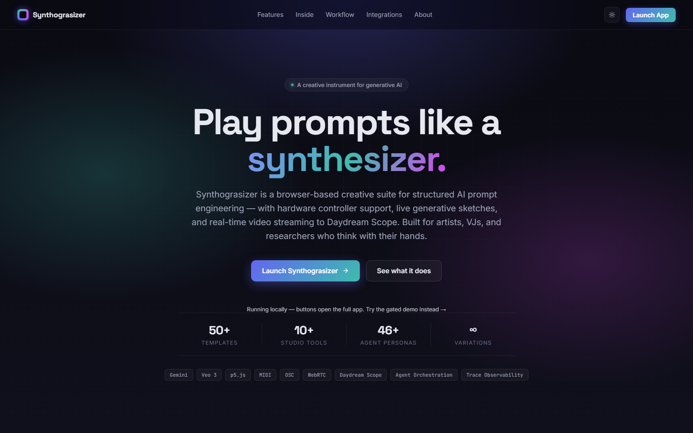
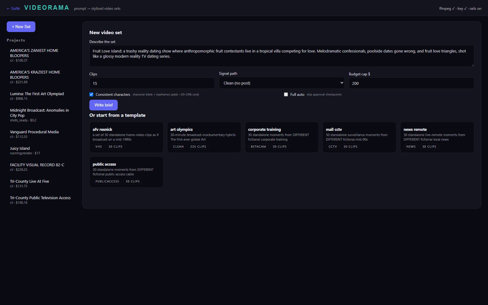
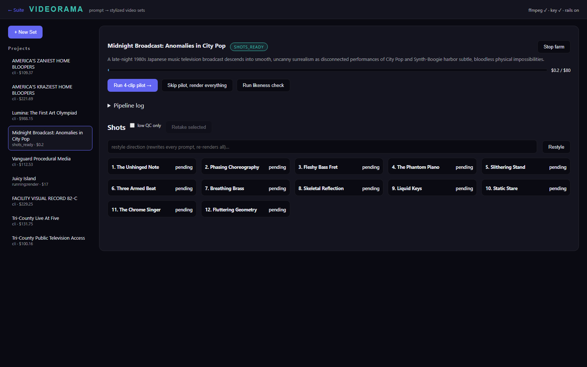
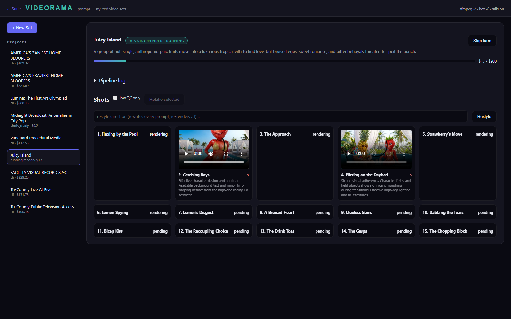
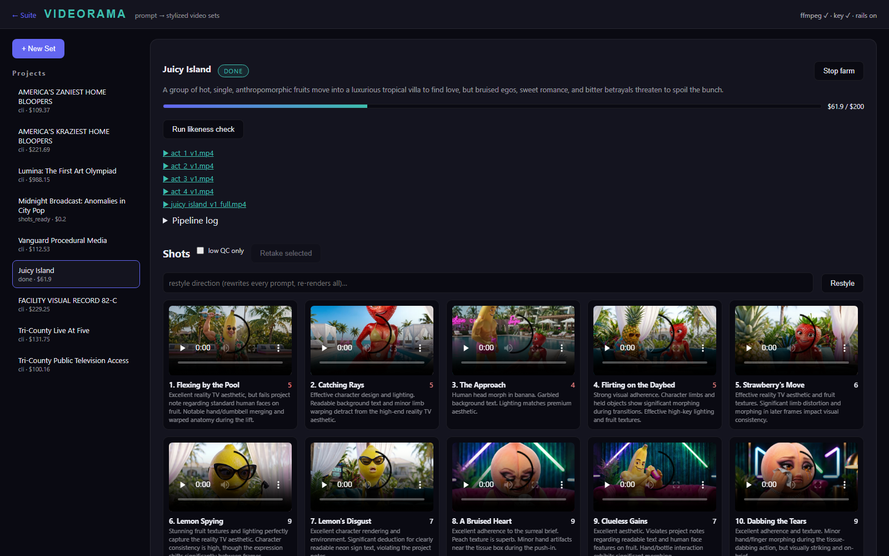

# Videorama — User Guide

*Prompt → a finished set of stylized video clips, entirely inside the
Synthograsizer Suite. This walkthrough builds a real project from scratch:
**"Fruit Love Island"** — a two-minute reality-dating-show story starring
anthropomorphic fruit — and shows every screen you'll touch along the way.*

Videorama is local-only: it drives Veo 3.1 / Nano Banana 2 render farms on
your machine, with your key, against a per-project budget cap. A hosted
Synthograsizer instance shows this page in browse-only mode.

---

## 0. Open Videorama

From the suite hub (`http://127.0.0.1:8000`), open the **Videorama** tile —
or go straight to `/videorama/`.



The header health strip tells you instantly whether the machine is ready:
`ffmpeg ✓ · key ✓ · rails on`. If ffmpeg is missing you can still render,
but signal-path post-processing and QC frame-grading are skipped. "Rails"
are the safety guardrails baked into the brief writer (see §9).

## 1. Describe the set

Click **+ New Set** and describe what you want in plain language. For this
walkthrough:

> *Fruit Love Island: a trashy reality dating show where anthropomorphic
> fruit contestants live in a tropical villa competing for love.
> Melodramatic confessionals, poolside dates gone wrong, and fruit love
> triangles, shot like a glossy modern reality TV dating series.*



The knobs that matter:

| Control | What it does | Fruit Love Island choice |
|---|---|---|
| **Clips** | Number of 8-second shots (a 2-minute story = 15) | `15` |
| **Signal path** | Era-correct post-processing (VHS, CCTV, Betacam, news ENG, public-access) or *Clean* for modern looks. *Auto* lets the brief writer pick. | `Clean (no post)` — modern reality TV is glossy |
| **Format** | `16:9` landscape or `9:16` vertical (Snapchat/TikTok/Reels) — sets aspect for every keyframe and Veo call, and pads the assembled reel accordingly. | `16:9` |
| **Budget cap $** | Hard spend ceiling; every stage stops when reached | `200` |
| **Consistent characters** | Builds a character bible (reference sheets) + per-shot keyframes so the same cast appears in every clip. Adds ~20–35% cost. | ✅ — a dating show needs a cast |
| **Full auto** | Skip the approval checkpoints and run prompt→finished reel in one shot | off (checkpoints recommended) |

Alternatively, click any card in **Or start from a template** to reuse a
proven format — six formats ship by default (home-video bloopers, art
olympics, corporate training, mall CCTV, news remotes, public access), and the
gallery grows every time you use **Save as template** (§4b) on a project you
like.

Click **Write brief**. The Brief Writer (Gemini) designs the whole format:
concept, incident register, "production truth" (camera platform, lighting,
staging), a recurring cast with redrawable descriptions, locations, per-shot
rules, and QC grading notes. It costs pennies and takes ~20 seconds.
You'll be dropped into the project dashboard at the first checkpoint.

## 2. Checkpoint one — the shot list

Click **Generate shot list →**. A showrunner pass invents the specifics
(ours renamed the piece **"Juicy Island"** and cast *the muscular banana,
the glamorous strawberry, the stoic pineapple, the emotional peach*), then a
shot-writer pass scripts every 8-second clip. A couple of minutes later the
project lands at `SHOTS_READY`:



*(screenshot shows a sibling project at the same checkpoint)*

Every shot card shows its title and status; the full Veo prompt is stored
per shot. Read a few titles — if the story isn't right, this is the cheap
moment to **Restyle** (bottom bar rewrites every prompt to a new direction,
$1-ish) or delete the project and re-prompt. Nothing has touched the video
budget yet: total spend so far is ~$0.25.

## 3. Checkpoint two — the 4-clip pilot

Click **Run 4-clip pilot →**. Because *Consistent characters* is on, the
pipeline first builds the **character bible** (one NB2 reference sheet per
cast member + location plates + style frames), then **keyframes** (a
composed still per shot, conditioned on the sheets), then renders the first
4 shots with Veo. ~10 minutes, ~$15.



While a farm runs you'll see the live state chip (`RUNNING:RENDER`), the
spend meter filling toward the cap, and the **Pipeline log**. Content-filter
rejections are normal and self-healing — the farm retries unchanged once
(the filter is probabilistic), then auto-softens the prompt. Our banana's
"tiny neon swim trunks" needed exactly that treatment.

When the pilot lands, review the clips **with sound** (thumbnails come from
the QC grader's frame samples; click to play). You're checking the look,
the cast consistency, and the tone — the things the automatic grader can't
taste. Then either **Approve — render everything →** or **Re-run pilot**.

## 4. Review, retake, likeness



After the full render every shot card carries a QC score (0–10) and the
grader's notes. The workflow from here:

- **low QC only** filter → see the weak takes at a glance.
- Click cards to select → **Retake selected** re-rolls just those shots
  (two fresh takes each, best one wins).
- **Restyle** rewrites every prompt to a new visual direction and re-renders
  the whole set — same story, new look. This is a full re-spend of the
  render budget, so the UI asks first.
- **Run likeness check** screens the character sheets against real
  celebrities (an NB2 sheet once cast Morgan Freeman as a scrap-metal
  artist; this button exists because of that day). Flagged characters
  should be regenerated before publishing anything.

## 5. The Shot Inspector — never get stuck on one clip

Click any shot card (not the video itself, and not its checkbox — those are
for bulk **Retake selected**) to open the **Inspector**: a per-shot workshop
for the moments the automatic pipeline can't fix on its own.

- **Edit the prompt** in the textarea, then **Save** (just writes it) or
  **Save & Retake** (writes it and re-renders — this erases the shot's take
  history, so the take table's caption warns you first).
- **Suggest variations** asks Gemini for a handful of alternate motion/framing
  directions for this exact shot; click a chip to drop it into the prompt.
- **Pin/unpin the keyframe** — toggling this switches the shot between
  image-to-video (a composed NB2 still pins the exact framing) and
  text-to-video (looser, driven by the character reference sheets). This is
  the fix for **"Veo won't hold an unusual camera angle"** — a locked-off
  ceiling-mount CCTV shot, for instance, holds far more reliably from a
  pinned keyframe than from text alone.
- **Reimagine keyframe** — describe a change ("make it golden hour", "shift
  the palette to teal and rust") and NB2 repaints the shot's current still
  (or, if there's no keyframe yet, the nearest QC-sampled frame from its
  best take). ~$0.20. This is also the fix for a shot whose *reference
  sheet itself* trips the content filter no matter how the prompt is worded —
  reimagine or pin a clean keyframe, then retake as image-to-video instead.
- **Extend +8s →** continues the shot's motion into a brand-new sequel shot
  inserted right after it. Two paths, chosen automatically: a seamless Veo
  extension when the selected take is a fresh (<48h) 720p source, otherwise a
  last-frame image-to-video chain at full 1080p — so it always works, just at
  a slightly different fidelity.
- **Continue →** is the manual version: it grabs the shot's last frame as a
  new keyframe and opens an editable prompt for what happens next. Review and
  tweak, then **Save & Retake** the new sequel shot to render it.
- **Exclude from cut** / **↑ / ↓** control what's in the final assembly and
  in what order, without touching the render itself (see §7).

None of this needs the CLI or SQL — every fix that used to require dropping
into the database now has a button.

## 6. Cast & Locations — manage the reference sheets

The collapsible **Cast & Locations** panel (below the pipeline log) shows
every character/location/style sheet the bible stage generated. Per asset:

- **Regenerate** (optionally with a tweak — "older, silver-framed glasses")
  redraws the sheet from its original prompt. ~$0.15.
- **Upload…**, or just drag an image onto the card, replaces the sheet
  outright with your own picture — useful for locking a likeness, fixing a
  **Run likeness check** flag, or swapping in a real reference photo/concept
  art.
- Either action offers to **reset the keyframes** for every shot that uses
  this asset (matched by character/location id), and optionally regenerate
  them immediately — so a cast change propagates to every affected shot
  without you having to find them one by one.

## 7. Growing and re-cutting a finished project

Two dashboard buttons extend a project after its first "done":

- **Add shots…** writes N new shots as a new act, in whatever direction you
  describe ("a storm hits the villa"), reusing the existing cast and
  locations. They land at `pending` — run **finish** (or render them
  individually from the Inspector) to generate the footage.
- **Reassemble ↺** rebuilds the reel from the current state of every shot —
  after excluding some, reordering others, or adding new ones — without
  re-rendering anything. Each reassembly is a new version (`v2`, `v3`, …);
  older exports are never overwritten.

## 8. The deliverables

The **exports** links at the top of the dashboard are the assembled reels
(per-act + full cut). On disk, every project is a folder under
`D:\Synthograsizer_Films\<slug>` (override with `SYNTH_FILMS_ROOT`):

```
fruit_love_island/
├── brief.json            the generated production brief (editable)
├── film.json             showrunner bible: cast, locations, style anchor
├── film.db               all state: shots, takes, QC scores, spend ledger
├── film.log              full pipeline log
├── bible/                character/location reference sheets (PNG)
├── keyframes/            per-shot composed stills
├── takes/                every rendered take (MP4, keep for re-edits)
├── tape/                 signal-path-processed clips (if a preset is set)
└── exports/              assembled reels + manifest.csv
```

The individual `takes/` are often the real deliverable — post them as
shorts, or recut them outside the suite. `manifest.csv` is the edit's paper
trail (shot, take, QC score, cost). Regenerated bible sheets and Inspector
"reimagined" keyframes are saved as new versioned files (`_v2`, `_r1`, …)
rather than overwriting the original — nothing is silently replaced.

## 9. If something breaks

- **A job dies mid-run** (server restart, crash): the project shows
  **Resume where it stopped →**. Every stage skips finished work, so resume
  is always safe — a 90%-rendered farm only pays for the missing 10%.
- **Stop farm** writes a STOP file; in-flight clips finish, nothing new
  starts. Resume later with the same button.
- **A shot keeps failing the content filter** even after softening: open it
  in the Inspector (§5) and either reword the prompt, or — if it's the
  *reference sheet* itself tripping the filter (common with swimwear/
  physique-heavy character descriptions) — reimagine or pin a clean keyframe
  and retake as image-to-video instead.
- **Veo won't hold an unusual camera direction** (e.g. ceiling-mount
  surveillance angles): pin a keyframe for that shot in the Inspector (§5) —
  a composed NB2 still holds framing far more reliably than text-to-video.

## 10. The guardrails (why "rails on")

The Brief Writer hard-codes production rules learned the hard way across many
productions: adults only, no real people/names/brands (they trip Veo's
celebrity filter *and* create publishing risk), no readable on-screen text
(models render gibberish), dialogue limited to one speaker per shot. For
registers that imitate "real" formats (news, CCTV, documentary, dashcam), an
**unreality rail** additionally requires every clip to be impossible at a
glance and bans plausibly-real events — so nothing you generate can pass as
real footage of a real occurrence. Rails are on by default
(`SYNTH_VIDEORAMA_RAILS=off` is the operator override). Veo output carries
SynthID watermarking; disclose AI generation where you publish.

## 11. Scripting it — CLI & unattended batches

Everything the UI does is also a CLI stage, and the UI's job-runner just
subprocesses the same commands — so a script can drive Videorama with no
server running at all:

```bash
python -m scripts.film_factory develop   --project-dir D:\Synthograsizer_Films\my_project --brief my_brief.json
python -m scripts.film_factory render    --project-dir D:\Synthograsizer_Films\my_project --concurrency 4 --max-takes 2
python -m scripts.film_factory tapeify   --project-dir D:\Synthograsizer_Films\my_project      # if using a signal preset
python -m scripts.film_factory assemble  --project-dir D:\Synthograsizer_Films\my_project --version v1
```

For a **queue of many concepts run back-to-back unattended** — the pattern
behind large overnight batches — see `scripts/film_factory/overnight.py`: a
plain list of concept specs (prompt, clip count, aspect, signal preset),
looped through develop→render→assemble with each batch wrapped in its own
`try/except` so one failure never stops the queue, a running spend total
checked against a global cap before each batch, and a `STOP` file for a clean
early exit. Because every stage is idempotent, re-running the same script
after a crash or reboot **skips every already-assembled batch** and picks up
exactly where it left off — this is what makes it safe to kick off a
multi-hour run and walk away.

## Cost cheat-sheet (estimates)

| Item | Cost |
|---|---|
| Brief + shot list | ~$0.25 |
| Character bible + 15 keyframes | ~$3 |
| One 8s Veo take (1080p, audio) | ~$3.20 |
| 15-clip set, QC-gated retakes | $50–75 |
| 30-clip set | $100–150 |
| 30-minute film (225 shots) | ~$1,000 |
